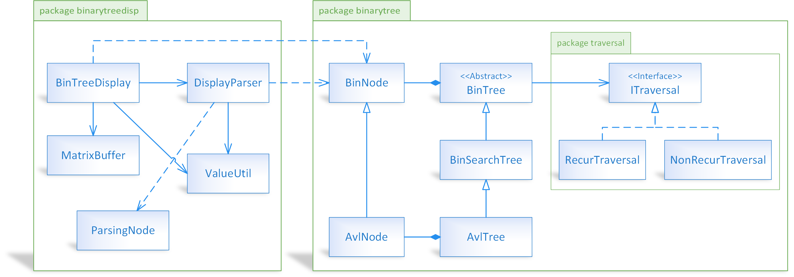

# BINARY TREE DATA STRUCTURE IN C++

## DESCRIPTION

My implementation of binary trees in C++.

This project is ported from my original project ```bintree_py``` (using Python).

The following sections are copied from original ```bintree_py/README```.

&nbsp;

## FEATURES

Binary trees:

- 3 types of trees: Binary Tree, Binary Search Tree, AVL Tree.
- Regular operations:
  - Checking empty.
  - Getting height.
  - Counting nodes.
  - Traversal:
    - 3 options: pre-order, in-order, post-order.
    - 2 modes: recursive traversal and non-recursive traversal.
  - Checking existence of a key.
  - Getting minimum key.
  - Getting maximum key.
  - Insertion.
  - Removal.
  - Constructing from a list.

Plus, I develop ```BinTreeDisplay```, which allows displaying binary tree in ASCII text:

- It can config branch spacing. The more branch spacing, the more width of the tree.
- It can config precision of floating-point numbers.
- It accepts any type of key of node. Just makes sure key is convertible to string.
- It accepts any structure of node, which is high flexibily.
- It can config left margin.
- It outputs to a string or a list of rows.

Output example generated by ```BinTreeDisplay```:

```text
                            100
                            |
                 -----------------------------
                50                           70000
                |                            |
         -------------                ----------
        10           88.524       20000        90000
        |            |            |
      -----        ---          -----
-123456   14.78   62          500   30000.19
                                    |
                                    ---
                                      40000
```

&nbsp;

## CODE STRUCTURE

### DIRECTORY STRUCTURE

- ```binarytree```: package "binary tree", which comprises modules ```BinTree```, ```BinSearchTree```, ```AvlTree```.
- ```binarytreedisp```: package "binary tree display", which comprises module ```BinTreeDisplay```.
- ```test```: testing script.

### CLASS DIAGRAM OVERVIEW



**Please note that** I try to design the class system as simple as possible to help you learn in an easiest way. When you get all of this, you are able to:

- Separate binary tree into various modules: search module, clone module, branch rotation module...
- Implement node iterator.
- Simplify system.

&nbsp;

## PROJECT SPECIFICATIONS

- Language: C++ 11
- Paradigms: object-oriented, procedural, generic

**WARNING:** If you do not meet the above prerequisites (language/framework version), the code might not compile.

&nbsp;

## BUILDING THE CODE

### gcc/g++ in Linux environments

**Step 1.** Change working directory to this directory.

**Step 2.**

```shell
g++ -o outputexec -I ./  binarytree/*.hpp  binarytreedisp/*.hpp  *.cpp
```

or

```shell
sh build.sh
```

If the build succeeds, there is a executable file named ```outputexec```. Make sure this file has execute permission. Now we can run the program:

```shell
./outputexec
```

### Windows

**METHOD 1.** MinGW

Just like above section (gcc/g++ with Linux environments).

**METHOD 2.** Visual Studio

**Step 1.** Copy-and-add ```main.cpp``` and directories ```binarytree, binarytreedisp, test``` to Visual Studio project. Do not change directory structure.

**Step 2.** Build and run.

Note: Code is tested in Visual Studio 2019 v16.9.4 with MSVC v19.28.29914.

**METHOD 3.** CodeBlocks

**Step 1.** Copy-and-add ```main.cpp``` and all files from ```binarytree, binarytreedisp, test``` to CodeBlocks project. Do not change directory structure.

**Step 2.** Configure build options. Add project directory to ```Search directories```.

**Step 3.** Build and run.

Note: Code is tested in CodeBlocks 17.12 with MinGW g++ (tdm-1) 5.1.0.

&nbsp;

## CONVENTIONS

1. Respect the clean code.
2. Respect the simplicity over the complexity.
3. Respect the organization over the algorithms.
4. Focus on high performance, code reuse, code maintenance.

Plus, by using C++:

- Due to portability, **each module is fully presented in a single file**.
- **Prefer C++ pointers** to C++ references (because C++ pointers are compatible with other common programming languages).

&nbsp;

## LICENSE

Copyright (c) Thanh Trung NGUYEN.

This project is licensed under the [3-Clause BSD License](LICENSE.txt).
