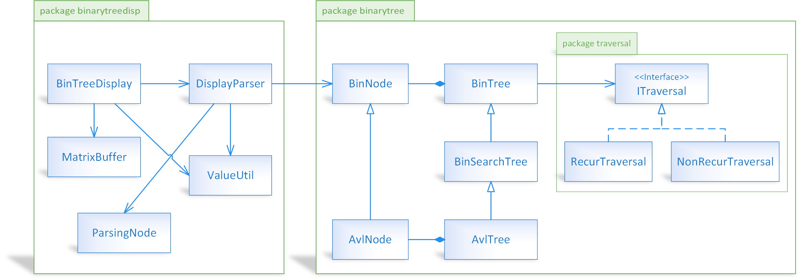

# BINARY TREE DATA STRUCTURE IN C\#

## DESCRIPTION

My implementation of binary trees in C#.

This project is ported from my original project ```bintree_py``` (using Python).

The following sections are copied from original ```bintree_py/README```.

&nbsp;

## FEATURES

Binary trees:

- 3 types of trees: Binary Tree, Binary Search Tree, AVL Tree.
- Regular operations:
  - Checking empty.
  - Getting height.
  - Counting nodes.
  - Traversal:
    - 3 options: pre-order, in-order, post-order.
    - 2 modes: recursive traversal and non-recursive traversal.
  - Checking existence of a key.
  - Getting minimum key.
  - Getting maximum key.
  - Insertion.
  - Removal.
  - Constructing from a list.

Plus, I develop ```BinTreeDisplay```, which allows displaying binary tree in ASCII text:

- It can config branch spacing. The more branch spacing, the more width of the tree.
- It can config precision of floating-point numbers.
- It accepts any type of key of node. Just makes sure key is convertible to string.
- It accepts any structure of node, which is high flexibily.
- It can config left margin.
- It outputs to a string or a list of rows.

Output example generated by ```BinTreeDisplay```:

```text
                            100
                            |
                 -----------------------------
                50                           70000
                |                            |
         -------------                ----------
        10           88.524       20000        90000
        |            |            |
      -----        ---          -----
-123456   14.78   62          500   30000.19
                                    |
                                    ---
                                      40000
```

&nbsp;

## CODE STRUCTURE

### DIRECTORY STRUCTURE

- ```binarytree```: package "binary tree", which comprises modules ```BinTree```, ```BinSearchTree```, ```AvlTree```.
- ```binarytreedisp```: package "binary tree display", which comprises module ```BinTreeDisplay```.
- ```test```: testing script.

### CLASS DIAGRAM OVERVIEW



&nbsp;

## PROJECT SPECIFICATIONS

- Language: C# 9.0
- Framework: .NET 5 (succeeding .NET Core 3.1)
- Paradigms: object-oriented, generic

**WARNING:** If you do not meet the above prerequisites (language/framework version), the code might not compile.

&nbsp;

## CONVENTIONS

1. Respect the clean code.
2. Respect the simplicity over the complexity.
3. Respect the organization over the algorithms.
4. Focus on high performance, code reuse, code maintenance.

&nbsp;

## LICENSE

Copyright (c) Thanh Trung NGUYEN.

This project is licensed under the [3-Clause BSD License](LICENSE.txt).
